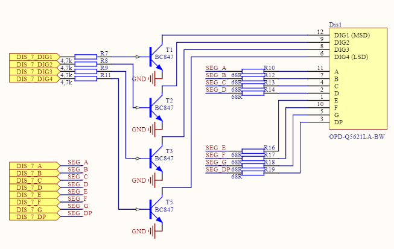

<h1>Register controlled timer with STM32L496ZGT6 microcontroller (Kameleon board)</h1>

The aim of this small project was to make a timer, that counts from 0 to 9999, with the use of 4 digit 7-segment display, and not using HAL standard library, but configure GPIO and TIM6 timer by hand, using registers.

The stucture of display is as follows:

From also this circuitry document, we can also see, that segments are connected like:

<table>
  <tr>
    <th>7S_A</th>
    <th>7S_B</th>
    <th>7S_C</th>
    <th>7S_D</th>
    <th>7S_E</th>
    <th>7S_F</th>
    <th>7S_G</th>
  </tr>
  <tr>
    <td>PG0</td>
    <td>PG1</td>
    <td>PG2</td>
    <td>PG3</td>
    <td>PG4</td>
    <td>PG5</td>
    <td>PG6</td>
  </tr>
</table>

Cathode connections:

<table>
  <tr>
    <th>7S_DIG1</th>
    <th>7S_DIG2</th>
    <th>7S_DIG3</th>
    <th>7S_DIG4</th>
  </tr>
  <tr>
    <td>PB2</td>
    <td>PB3</td>
    <td>PB4</td>
    <td>PB5</td>
  </tr>
</table>

Button input:

<table>
  <tr>
    <th>JOY_OK</th>
  </tr>
  <tr>
    <td>PE15</td>
  </tr>
</table>

Then, with the use of the manual, the memory adresses of GPIO, and TIM6 were found, together with the structure of registers thay have. As soon, as the microcontroller uses 32bit registers, the memory space for each register will be 4 bytes, and thus the unsigned 32 bit integer template will be used (Not int, because we need to be aware of operating system, on which we use the compiler, because somewhere int is 64bit or 96bit or even 128bit)

<a href="https://kameleonboard.org/wp-content/uploads/STM32L496ZGT6-Reference-Manual.pdf">STM32L4x5 and STM32L4x6 memory and periferial devices manual</a>

<table>
  <tr>
    <th>GPIO B</th>
    <th>0x48000400</th>
  </tr>
  <tr>
    <th>GPIO E</th>
    <th>0x48001000</th>
  </tr>
  <tr>
    <th>GPIO G</th>
    <th>0x48001800</th>
  </tr>
  <tr>
    <th>TIM 6</th>
    <th>0x40001000</th>
  </tr>
  <tr>
    <th>PWR_CR2</th>
    <th>0x40007000</th>
  </tr>
</table>

The GPIO structure with registers will look like:

<table>
  <tr>
    <th>Register</th>
    <th>Adress offcet</th>
  </tr>
  <tr>
    <td>MODER</td>
    <td>0</td>
  </tr>
  <tr>
    <td>OTYPER</td>
    <td>4</td>
  </tr>
  <tr>
    <td>OSPEEDR</td>
    <td>8</td>
  </tr>
  <tr>
    <td>PUPDR</td>
    <td>C</td>
  </tr>
  <tr>
    <td>IDR</td>
    <td>10</td>
  </tr>
  <tr>
    <td>ODR</td>
    <td>14</td>
  </tr>
  <tr>
    <td>BSRR</td>
    <td>18</td>
  </tr>
  <tr>
    <td>DUMMY[3]</td>
    <td>1C</td>
  </tr>
  <tr>
    <td>BRR</td>
    <td>2C</td>
  </tr>
</table>

The Timer structure with registers will look like:

<table>
  <tr>
    <th>Register</th>
    <th>Adress offcet</th>
  </tr>
  <tr>
    <td>TIM6_CR1</td>
    <td>0</td>
  </tr>
  <tr>
    <td>DUMMY[3]</td>
    <td>4</td>
  </tr>
  <tr>
    <td>TIM6_SR</td>
    <td>10</td>
  </tr>
  <tr>
    <td>TIM6_EGR</td>
    <td>14</td>
  </tr>
  <tr>
    <td>DUMMY1[4]</td>
    <td>18</td>
  </tr>
  <tr>
    <td>TIM6_PSC</td>
    <td>24</td>
  </tr>
  <tr>
    <td>TIM6_ARR</td>
    <td>28</td>
  </tr>
</table>

<h2>TIM6 timer configuration</h2>

For TIM6 timer we define a prescaler and autoreload registers for timer to act as it will generate signal each 1 millisecond. From manual, we can say, that TIM6 has 4MHz frequency. To make it act like 1kHz timer, we will make a prescaler to be 3 (counter counting from 0 to 3, which is 4 cycles in total), and then set to autoreload register value of 1000, so that the timer will emiit signal, when reaching the value of 1000.

The delay function works in the way, that it uses the empty while loop, till SR register will become 1. Then, the cycle repeats, until the value of required milliseconds is achieved

<h2>GPIO configuration</h2>

the GPIOinit() function takes the GPIO port and configures it ia

